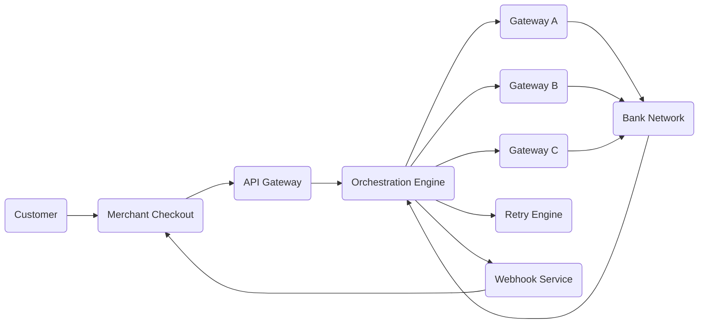
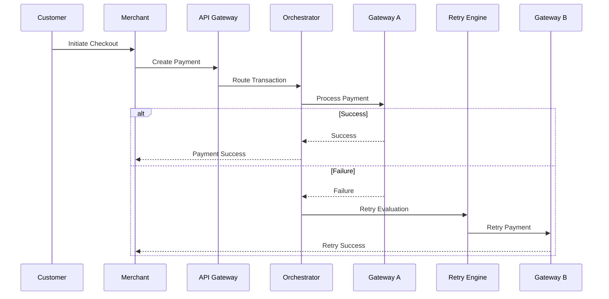

# Payment Orchestration Case Study

## Overview

This repository demonstrates a conceptual payment orchestration system for modern fintech platforms.

The project focuses on:
- Multi-gateway routing
- Retry mechanisms
- Tokenized payment flows
- Webhook architecture
- Merchant payment lifecycle
- Payment reliability
- Scalability considerations

---

# Business Problem

Payment failures directly impact:
- Merchant revenue
- Customer trust
- Checkout conversion
- Repeat purchases

Modern payment systems require intelligent routing and retry mechanisms to improve transaction success rates.

---

# Product Goals

- Improve payment success rates
- Reduce checkout failures
- Support scalable payment processing
- Enable gateway failover
- Improve merchant experience
- Optimize retry recovery

---

# System Components

| Component | Purpose |
|---|---|
| API Gateway | Handles payment requests |
| Orchestration Engine | Routes transactions |
| Retry Engine | Handles failed retries |
| Token Service | Manages tokenized payments |
| Notification Service | Sends webhooks |
| Analytics Layer | Tracks payment metrics |

---

# Payment Flow

## Step 1 — Customer Initiates Payment

Customer selects payment method during checkout.

---

## Step 2 — Merchant Creates Payment Request

Merchant backend sends payment request to orchestration API.

---

## Step 3 — Gateway Selection

Routing engine selects optimal payment gateway based on:
- Success rate
- Latency
- Merchant configuration
- Transaction type

---

## Step 4 — Payment Authorization

Gateway processes authorization with banking partner.

---

## Step 5 — Retry Handling

If transaction fails:
- Retry engine evaluates retry rules
- Alternative gateway may be selected
- Duplicate protection applied

---

## Step 6 — Webhook Notification

Merchant receives asynchronous payment status callback.

---

# Architecture Diagram



---

# Sequence Diagram



---

# Sample API Request

```json
{
  "merchant_id": "MID1001",
  "payment_id": "PAY12345",
  "amount": 500,
  "currency": "INR",
  "payment_method": "CARD"
}
```

---

# Sample API Response

```json
{
  "status": "SUCCESS",
  "gateway": "Gateway-A",
  "transaction_id": "TXN78901"
}
```

---

# Retry Logic

| Scenario | Action |
|---|---|
| Timeout | Retry |
| Gateway Failure | Switch Gateway |
| Duplicate Request | Reject |
| Bank Downtime | Queue Retry |

---

# Product Metrics

| Metric | Target |
|---|---|
| Payment Success Rate | >95% |
| Retry Recovery Rate | >15% |
| Checkout Conversion | Increase |
| Gateway Latency | <2 seconds |

---

# Scalability Considerations

- Distributed processing
- Idempotent APIs
- Queue-based retries
- Horizontal scaling
- Async webhook processing
- Observability and monitoring

---

# Future Enhancements

- AI-based routing
- Smart retry prediction
- Fraud scoring
- Real-time analytics
- Merchant dashboards

---

# Tech Stack (Conceptual)

- REST APIs
- JSON
- Webhooks
- PostgreSQL
- Kafka
- Redis
- Kubernetes

---

# Learning Outcomes

This project demonstrates:
- Payment systems understanding
- Technical product thinking
- API architecture concepts
- Scalability design
- Fintech domain expertise

---

# Author

Ankit Phartiyal

Senior Technical Product Manager  
Fintech | Payments | APIs | Product Strategy
