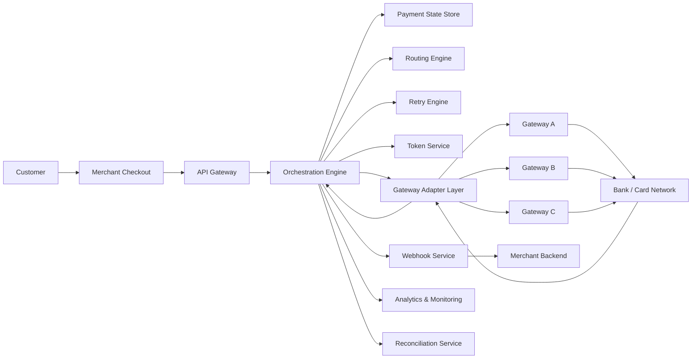
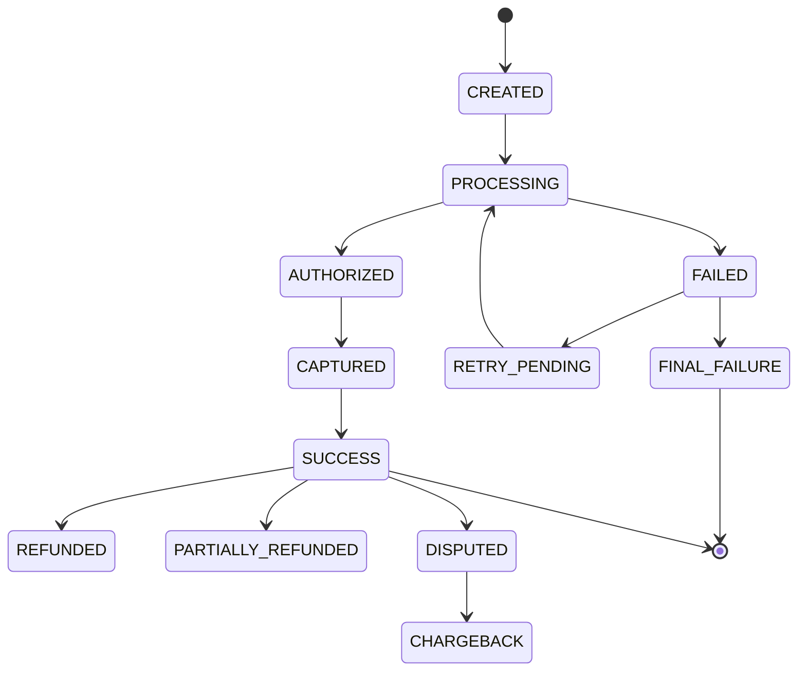
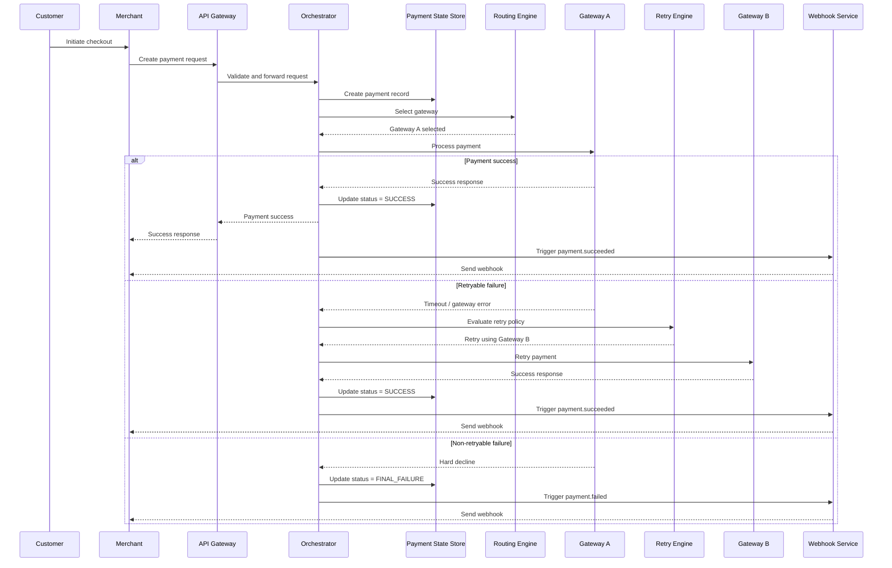

# Payment Orchestration Case Study

## Overview

This repository presents a **technical product case study** for a modern **Payment Orchestration Platform**.

The objective of the system is to improve payment reliability, checkout conversion, and merchant experience by using:

- Multi-gateway payment routing
- Intelligent retry handling
- Gateway failover
- Tokenized payment flows
- Idempotent APIs
- Webhook-based merchant notifications
- Scalable and observable payment infrastructure

This is a **conceptual case study** designed to demonstrate product thinking, API design, fintech domain knowledge, system design, and payment reliability strategy.

---

## Business Problem

Payment failures directly impact business outcomes.

Failed payments can lead to:

- Lost merchant revenue
- Poor customer experience
- Reduced checkout conversion
- Lower repeat purchases
- Increased customer support tickets
- Lower merchant trust in the platform

Modern fintech platforms need intelligent payment orchestration to maximize transaction success rates while maintaining reliability, security, and scalability.

---

## Product Goals

The payment orchestration system aims to:

- Improve payment success rates
- Reduce checkout failures
- Support multi-gateway processing
- Enable automatic gateway failover
- Recover eligible failed transactions through retries
- Prevent duplicate payments
- Improve merchant visibility into payment status
- Support scalable and reliable payment processing
- Enable better monitoring, analytics, and operational control

---

## Scope

This case study covers:

- Payment creation flow
- Gateway selection logic
- Retry and failover strategy
- Tokenized payment handling
- Payment lifecycle management
- Webhook-based payment status updates
- Product metrics
- Scalability considerations
- Key trade-offs and future enhancements

---

## Non-Goals

This case study does not include:

- Real payment gateway integrations
- Live financial transaction processing
- Full PCI-compliant card vault implementation
- Complete fraud detection engine
- Settlement accounting implementation
- Chargeback operations workflow
- Production-ready source code

The focus is on **product architecture and system design** for payment orchestration.

---

## System Components

| Component | Purpose |
|---|---|
| API Gateway | Receives merchant payment requests and performs initial validation |
| Orchestration Engine | Coordinates payment lifecycle, routing, retries, and status updates |
| Routing Engine | Selects the best gateway based on rules, success rate, latency, and health |
| Gateway Adapter Layer | Normalizes communication with multiple payment gateways |
| Retry Engine | Evaluates retry eligibility and manages retry execution |
| Token Service | Handles tokenized payment methods securely |
| Payment State Store | Stores payment status, attempts, and lifecycle events |
| Webhook Service | Sends asynchronous payment status updates to merchants |
| Reconciliation Service | Matches internal payment records with gateway reports |
| Analytics Layer | Tracks payment metrics, success rates, failures, and latency |
| Observability Layer | Provides logs, metrics, traces, alerts, and dashboards |

---

## Functional Requirements

The system should support the following capabilities:

- Merchants can create payment requests through APIs.
- The system can route payments across multiple gateways.
- The system can retry eligible failed payments.
- The system can prevent duplicate payment creation using idempotency.
- The system can store payment lifecycle events.
- The system can send asynchronous webhooks to merchants.
- Merchants can query payment status.
- The system can track gateway-level performance.
- The system can support future integrations with fraud, reconciliation, and analytics modules.

---

## Non-Functional Requirements

| Requirement | Target |
|---|---|
| Availability | 99.9% or higher |
| API Latency | Low-latency payment creation |
| Gateway Failover | Automatic failover for eligible failures |
| Duplicate Protection | Idempotent payment creation |
| Security | Tokenized payment method handling |
| Scalability | Horizontally scalable services |
| Observability | Metrics, logs, traces, and alerts |
| Webhook Reliability | Retry with exponential backoff |
| Auditability | Complete payment attempt history |

---

## High-Level Architecture



---

## Payment Lifecycle

A payment goes through multiple states during its lifecycle.



---

## Payment Status Definitions

| Status | Description |
|---|---|
| CREATED | Payment request has been created |
| PROCESSING | Payment is being processed through a gateway |
| AUTHORIZED | Payment amount has been authorized |
| CAPTURED | Payment amount has been captured |
| SUCCESS | Payment completed successfully |
| FAILED | Payment attempt failed |
| RETRY_PENDING | Payment is eligible for retry |
| FINAL_FAILURE | Payment failed and will not be retried |
| REFUNDED | Full refund has been processed |
| PARTIALLY_REFUNDED | Partial refund has been processed |
| DISPUTED | Customer has disputed the payment |
| CHARGEBACK | Payment resulted in chargeback |

---

## Payment Flow

### Step 1: Customer Initiates Checkout

The customer selects a payment method on the merchant checkout page.

---

### Step 2: Merchant Creates Payment Request

The merchant backend sends a payment creation request to the payment orchestration API.

---

### Step 3: API Validation

The API Gateway validates:

- Merchant ID
- Amount
- Currency
- Payment method
- Idempotency key
- Required metadata

---

### Step 4: Gateway Selection

The Routing Engine selects the most suitable payment gateway using:

- Gateway health
- Payment method support
- Currency support
- Historical success rate
- Gateway latency
- Merchant configuration
- Transaction type
- Cost considerations

---

### Step 5: Payment Processing

The Orchestration Engine sends the payment request to the selected gateway through the Gateway Adapter Layer.

---

### Step 6: Retry Evaluation

If the payment fails, the Retry Engine evaluates whether the failure is retryable.

Examples of retryable failures:

- Timeout
- Gateway unavailable
- Network failure
- Bank downtime
- Gateway 5xx error

Examples of non-retryable failures:

- Invalid CVV
- Insufficient funds
- Stolen card
- Invalid card
- Risk decline

---

### Step 7: Payment Status Update

The Payment State Store is updated with the final or intermediate status.

---

### Step 8: Webhook Notification

The merchant receives an asynchronous webhook with the latest payment status.

---

## Sequence Diagram



---

## Gateway Routing Strategy

The Routing Engine selects the best gateway for each transaction.

### Routing Inputs

| Input | Description |
|---|---|
| Payment Method | Card, UPI, wallet, net banking, etc. |
| Currency | INR, USD, EUR, etc. |
| Amount | Transaction value |
| Merchant Rules | Merchant-specific gateway preferences |
| Gateway Health | Real-time gateway availability |
| Success Rate | Historical gateway performance |
| Latency | Gateway response time |
| Cost | Gateway processing cost |
| Transaction Type | Authorization, capture, refund, recurring payment |
| Bank/BIN Data | Issuer or card BIN-level performance |

---

### Gateway Scoring Example

```text
Gateway Score =
    Success Rate Weight
  + Latency Weight
  + Cost Weight
  + Merchant Preference Weight
  + Gateway Health Score
  + Payment Method Compatibility
```

---

### Routing Decision Flow

```text
1. Receive payment request.
2. Filter gateways by payment method and currency.
3. Remove unhealthy gateways.
4. Apply merchant-specific routing rules.
5. Score remaining gateways.
6. Select the highest-ranked gateway.
7. Store selected gateway and attempt details.
8. Process payment.
```

---

## Retry Strategy

The Retry Engine decides whether a failed payment should be retried.

### Retry Rules

| Failure Scenario | Retry? | Action |
|---|---:|---|
| Gateway timeout | Yes | Retry with same or alternate gateway |
| Gateway 5xx error | Yes | Switch gateway |
| Network failure | Yes | Queue retry |
| Bank downtime | Yes | Retry after delay |
| Gateway rate limit | Yes | Retry with backoff or alternate gateway |
| Duplicate request | No | Return original payment status |
| Invalid CVV | No | Mark as failed |
| Invalid card | No | Mark as failed |
| Insufficient funds | No | Mark as failed |
| Stolen card | No | Block retry |
| Fraud decline | No | Block retry |

---

## Retry Design Principles

- Retry only eligible failures.
- Avoid duplicate charges.
- Use idempotency keys for payment creation.
- Use attempt IDs for each gateway request.
- Apply retry limits.
- Use exponential backoff.
- Switch gateway only when supported.
- Store every attempt for audit and reconciliation.

---

## Sample API Request

```json
{
  "merchant_id": "MID1001",
  "order_id": "ORD98765",
  "payment_id": "PAY12345",
  "idempotency_key": "idem_7f8a9c123",
  "amount": {
    "value": 50000,
    "currency": "INR"
  },
  "payment_method": {
    "type": "CARD",
    "token": "tok_card_abc123"
  },
  "capture_method": "AUTOMATIC",
  "customer_id": "CUST456",
  "metadata": {
    "cart_id": "CART9001",
    "source": "web_checkout"
  }
}
```

---

## Sample API Response

```json
{
  "payment_id": "PAY12345",
  "order_id": "ORD98765",
  "status": "PROCESSING",
  "amount": {
    "value": 50000,
    "currency": "INR"
  },
  "selected_gateway": "Gateway-A",
  "gateway_attempt_id": "ATTEMPT001",
  "created_at": "2026-05-27T10:30:00Z",
  "next_action": null
}
```

---

## Sample Success Response

```json
{
  "payment_id": "PAY12345",
  "order_id": "ORD98765",
  "status": "SUCCESS",
  "amount": {
    "value": 50000,
    "currency": "INR"
  },
  "selected_gateway": "Gateway-A",
  "transaction_id": "TXN78901",
  "gateway_attempt_id": "ATTEMPT001",
  "processed_at": "2026-05-27T10:30:05Z"
}
```

---

## Sample Failure Response

```json
{
  "payment_id": "PAY12345",
  "order_id": "ORD98765",
  "status": "FINAL_FAILURE",
  "failure_code": "INVALID_CVV",
  "failure_message": "Payment failed due to invalid CVV",
  "retryable": false,
  "processed_at": "2026-05-27T10:30:05Z"
}
```

---

## Idempotency Handling

Idempotency prevents duplicate payment creation and duplicate charges.

### Why Idempotency Is Important

Payment APIs may receive duplicate requests due to:

- Merchant retrying after timeout
- Network failure
- Customer refreshing checkout page
- API client retry logic
- Delayed response from payment system

### Idempotency Rules

```text
1. Merchant sends an idempotency_key with every payment request.
2. System checks whether the key already exists for the merchant.
3. If the key is new, the system creates a new payment.
4. If the key already exists, the system returns the original payment response.
5. The system does not create a duplicate payment for the same key.
```

---

## Webhook Design

Webhooks notify merchants about asynchronous payment status changes.

### Supported Webhook Events

| Event | Description |
|---|---|
| payment.created | Payment has been created |
| payment.processing | Payment is being processed |
| payment.succeeded | Payment completed successfully |
| payment.failed | Payment failed |
| payment.retry_pending | Payment is scheduled for retry |
| payment.refunded | Payment was refunded |
| payment.disputed | Payment was disputed |

---

## Sample Webhook Payload

```json
{
  "event_id": "evt_12345",
  "event_type": "payment.succeeded",
  "created_at": "2026-05-27T10:31:00Z",
  "payment": {
    "payment_id": "PAY12345",
    "order_id": "ORD98765",
    "merchant_id": "MID1001",
    "status": "SUCCESS",
    "amount": {
      "value": 50000,
      "currency": "INR"
    },
    "transaction_id": "TXN78901"
  }
}
```

---

## Webhook Headers

```text
X-Webhook-Signature: signature_value
X-Webhook-Timestamp: 2026-05-27T10:31:00Z
X-Event-ID: evt_12345
```

---

## Webhook Reliability

Webhook delivery should be reliable and idempotent.

Design principles:

- Webhooks are sent asynchronously.
- Merchants should return HTTP 2xx after successful processing.
- Failed webhook deliveries are retried.
- Retry should use exponential backoff.
- Duplicate webhook delivery is possible.
- Merchants should process webhooks idempotently using `event_id`.
- Webhook payloads should be signed for security.

---

## Data Model

### Payments Table

| Field | Description |
|---|---|
| payment_id | Unique payment identifier |
| merchant_id | Merchant identifier |
| order_id | Merchant order identifier |
| idempotency_key | Unique key to prevent duplicate payments |
| amount | Payment amount in minor units |
| currency | Payment currency |
| status | Current payment status |
| selected_gateway | Gateway selected for processing |
| customer_id | Customer identifier |
| created_at | Payment creation timestamp |
| updated_at | Last update timestamp |

---

### Payment Attempts Table

| Field | Description |
|---|---|
| attempt_id | Unique attempt identifier |
| payment_id | Linked payment identifier |
| gateway | Gateway used for this attempt |
| status | Attempt status |
| failure_code | Failure reason code |
| failure_message | Failure description |
| retryable | Whether failure is retryable |
| created_at | Attempt creation timestamp |
| completed_at | Attempt completion timestamp |

---

### Webhook Events Table

| Field | Description |
|---|---|
| event_id | Unique webhook event identifier |
| payment_id | Linked payment identifier |
| merchant_id | Merchant identifier |
| event_type | Webhook event type |
| delivery_status | Pending, delivered, failed |
| retry_count | Number of delivery attempts |
| created_at | Event creation timestamp |
| delivered_at | Delivery timestamp |

---

## Product Metrics

| Metric | Definition | Target |
|---|---|---|
| Payment Success Rate | Successful payments / total payment attempts | >95% |
| Authorization Success Rate | Authorized payments / authorization attempts | >90% |
| Retry Recovery Rate | Failed payments recovered through retry | >15% |
| Gateway Latency P95 | 95th percentile gateway response time | <2 seconds |
| Webhook Delivery Success Rate | Successfully delivered webhooks / total webhooks | >99% |
| Duplicate Charge Rate | Duplicate charges / total successful payments | Near 0% |
| Payment Error Rate | System-caused failed payments / total payments | <1% |
| Gateway Failover Time | Time taken to switch from unhealthy gateway | <30 seconds |
| Merchant API Availability | Payment API uptime | 99.9%+ |

---

## Scalability Considerations

The system should be designed for high throughput and reliability.

Key scalability considerations:

- Horizontally scalable API services
- Stateless orchestration services
- Queue-based retry processing
- Async webhook delivery
- Distributed payment state storage
- Gateway health monitoring
- Circuit breakers for failing gateways
- Caching for merchant configuration
- Rate limiting for merchant APIs
- Partitioned data storage for high-volume transactions
- Observability across payment lifecycle

---

## Reliability Considerations

Payment systems require strong reliability controls.

Important controls:

- Idempotent payment APIs
- Gateway timeout handling
- Retry limits
- Circuit breakers
- Dead-letter queues
- Webhook retry mechanism
- Duplicate webhook protection
- Payment attempt audit logs
- Reconciliation reports
- Alerting on payment failure spikes

---

## Security Considerations

The system should follow secure payment design principles.

Key security considerations:

- Tokenized payment methods
- No raw card data stored in orchestration system
- Secure API authentication
- Merchant-level access control
- Signed webhook payloads
- Encrypted sensitive data
- Secure secrets management
- Audit logs for payment operations
- Fraud and risk integration readiness

---

## Risk and Trade-Off Analysis

| Decision | Benefit | Trade-Off |
|---|---|---|
| Multi-gateway routing | Improves success rate and availability | Increases integration complexity |
| Gateway adapter layer | Normalizes multiple gateway APIs | May hide gateway-specific features |
| Async webhooks | Improves reliability and scalability | Merchant receives final status asynchronously |
| Retry queue | Recovers retryable failures | Payment status may remain pending longer |
| Idempotency keys | Prevents duplicate payments | Requires careful key storage and lookup |
| Tokenization | Reduces sensitive data exposure | Requires secure token lifecycle management |
| Real-time routing | Optimizes gateway selection | Requires fresh metrics and monitoring |
| Circuit breakers | Protects system from failing gateways | May temporarily reduce gateway availability |

---

## Future Enhancements

Potential future improvements include:

- ML-based gateway routing
- Smart retry prediction
- Real-time gateway health scoring
- Cost-aware routing optimization
- Merchant dashboard for payment analytics
- A/B testing for routing strategies
- Fraud and risk scoring
- Refund and partial refund support
- Settlement and reconciliation module
- Chargeback and dispute management
- Real-time anomaly detection
- Payment method recommendation engine

---

## Tech Stack

This is a conceptual tech stack for the system.

| Area | Technology |
|---|---|
| APIs | REST APIs, JSON |
| Backend Services | Java, Node.js, Python, or Go |
| Database | PostgreSQL |
| Caching | Redis |
| Messaging | Kafka or RabbitMQ |
| Deployment | Kubernetes |
| Monitoring | Prometheus, Grafana |
| Logging | ELK Stack |
| Tracing | OpenTelemetry |
| Webhooks | HTTPS callbacks |
| Security | API keys, OAuth, HMAC signatures |

---

## Learning Outcomes

This case study demonstrates understanding of:

- Payment orchestration
- Multi-gateway routing
- Retry and failover design
- Payment lifecycle management
- Idempotent API design
- Webhook architecture
- Tokenized payment flows
- Fintech reliability patterns
- Product metrics definition
- Scalable system design
- Technical product management thinking

---

## Summary

A Payment Orchestration Platform improves payment reliability by intelligently routing transactions, retrying eligible failures, preventing duplicate payments, and providing merchants with reliable status updates.

This case study shows how a fintech platform can improve transaction success rates, reduce checkout failures, and build a scalable foundation for modern digital payments.

---

## Author

**Ankit Phartiyal**  
Senior Technical Product Manager  
Fintech | Payments | APIs | Product Strategy
