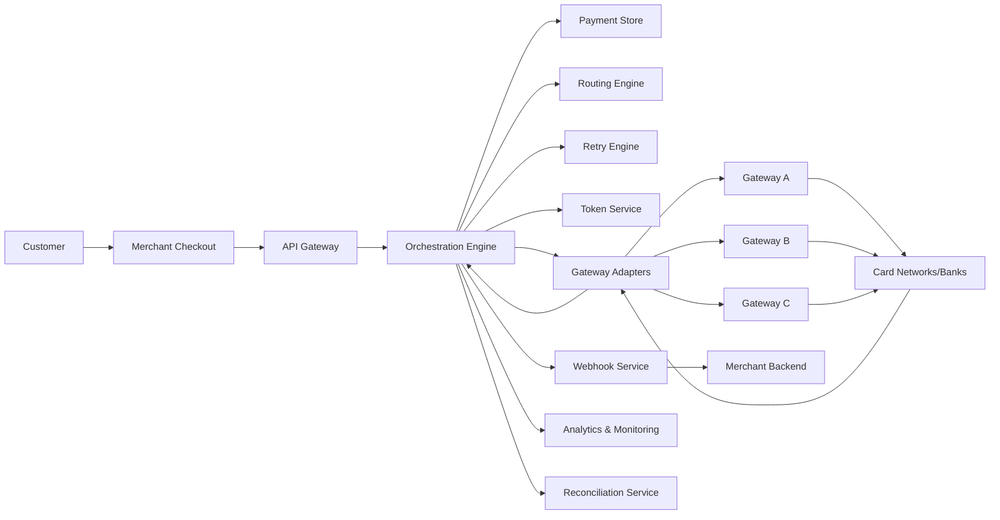
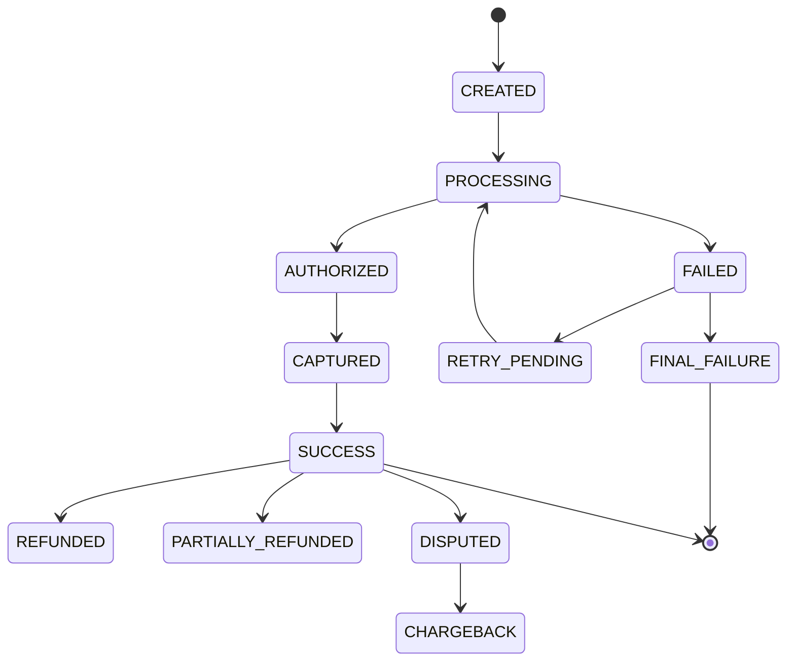
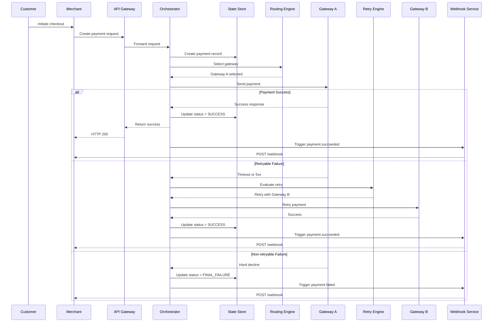

# Payment Orchestration Case Study

## Overview

Modern fintech platforms use payment orchestration to maximize transaction success and reliability. This case study demonstrates a conceptual payment orchestration system that uses multi-gateway routing, intelligent retries, failover handling, tokenization, idempotent APIs, and webhook notifications to improve checkout conversion and merchant experience.

Key focuses:
- Multi-gateway payment routing
- Intelligent retry logic
- Automatic failover
- Tokenized payment flows
- Idempotent API design
- Webhook-based status updates
- Scalability and observability

---

## Business Problem

Payment failures directly impact business outcomes. Common issues include:
- **Lost revenue:** Failed transactions mean lost sales.
- **Customer frustration:** Shoppers abandon carts when payments fail.
- **Checkout friction:** Re-entering payment details reduces conversion.
- **Operational costs:** Increased support tickets and refunds.
- **Merchant trust:** Repeated failures erode confidence.

Relying on a single payment service provider (PSP) makes failures more costly. For example, even short PSP outages during peak hours can halt checkouts and cost merchants thousands of dollars in lost sales. Static routing rules (e.g. “always use PSP A”) cannot adapt to changing conditions like geography, issuer behavior, or sudden provider issues. In practice, single-PSP outages, hard declines, and lack of dynamic retries directly translate into lost sales.

---

## Product Goals

The payment orchestration platform is designed to:
- **Increase approval rates** (e.g. improve success by 5–10%).
- **Reduce payment costs** via optimized routing (~10–30% savings).
- **Enhance reliability:** minimize downtime and transaction delays.
- **Enable automatic failover:** transparently handle PSP outages.
- **Recover failed transactions:** retry eligible payments without user action.
- **Prevent duplicates:** enforce idempotent APIs to avoid double charges.
- **Improve visibility:** provide merchants with real-time status.
- **Ensure scalability:** support high-volume, distributed processing.

---

## Scope

This case study focuses on the core architecture and product design of a payment orchestration system:
- Payment creation flow
- Gateway selection logic
- Retry and failover mechanisms
- Tokenized payment handling
- Payment lifecycle management
- Webhook-based status updates
- Monitoring, analytics, and metrics
- Key trade-offs and scalability

**Out of scope:** Real gateway integrations, PCI-compliant vaults, advanced fraud engines, settlements, and chargebacks.

---

## System Components

| Component              | Purpose                                                        |
|------------------------|----------------------------------------------------------------|
| **API Gateway**        | Receives and validates merchant payment requests (auth, rate limits, schema). |
| **Orchestration Engine** | Coordinates the payment lifecycle, routes to gateways, updates status. |
| **Routing Engine**     | Selects the best gateway based on rules, health, and metrics.  |
| **Gateway Adapters**   | Normalizes communication with each payment provider’s API.     |
| **Retry Engine**       | Determines retry eligibility and schedules retries.           |
| **Token Service**      | Manages secure payment tokens (for card vaults or wallets).    |
| **Payment Store**      | Stores payment records, statuses, and history.                |
| **Webhook Service**    | Sends asynchronous status updates (webhooks) to merchants.    |
| **Reconciliation Service** | Matches internal records with gateway settlement reports. |
| **Analytics Layer**    | Tracks key metrics (success rates, latency, errors) for optimization. |
| **Observability Layer**| Logs, metrics, traces, and alerts for system monitoring.      |

---

## Functional Requirements

- Merchants can create payments via API (with idempotency key).
- Route each payment through one of multiple gateways.
- Retry failed payments if possible.
- Prevent duplicate payments using idempotency.
- Store all payment lifecycle events.
- Send asynchronous webhooks on status changes.
- Allow merchants to query payment status.
- Monitor gateway health and performance.
- Support future integration with fraud, analytics, and reconciliation modules.

---

## Non-Functional Requirements

| Requirement         | Target                      |
|---------------------|-----------------------------|
| **Availability**    | 99.9% uptime               |
| **Latency**         | Low-latency API responses  |
| **Scalability**     | Horizontally scalable      |
| **Fault Tolerance** | Automatic gateway failover |
| **Idempotency**     | Guaranteed duplicate protection |
| **Security**        | Tokenized data, secure auth |
| **Observability**   | Metrics, logs, traces, alerts |
| **Webhook Delivery**| Reliable, retried notifications |
| **Auditability**    | Complete payment history   |

---

## High-Level Architecture



---

## Payment Lifecycle



**States:**

- **CREATED:** Payment request has been received.
- **PROCESSING:** Payment is being sent to a gateway.
- **AUTHORIZED:** Amount has been authorized (for card holds).
- **CAPTURED:** Amount has been captured/settled.
- **SUCCESS:** Payment completed successfully.
- **FAILED:** A payment attempt has failed (retry not yet attempted).
- **RETRY_PENDING:** Eligible for retry.
- **FINAL_FAILURE:** No more attempts; marked as failed.
- **REFUNDED / PARTIALLY_REFUNDED:** Funds were returned.
- **DISPUTED:** Customer dispute raised.
- **CHARGEBACK:** Chargeback reported by issuer.

---

## Payment Flow

### Step 1 — Customer Initiates Checkout

The customer selects a payment method and proceeds to checkout.

### Step 2 — Merchant Creates Payment Request

The merchant backend calls the orchestration API to create a payment.

### Step 3 — API Validation

The API Gateway validates the request (merchant ID, amount, currency, payment method, idempotency key, etc.).

### Step 4 — Gateway Selection

The Routing Engine evaluates available gateways based on:
- Gateway health and uptime.
- Payment method support (card, UPI, wallet, etc.).
- Currency support.
- Historical success rates.
- Latency and geographic proximity.
- Transaction value and risk.
- Merchant-specific preferences and rules.
- Cost per transaction.

It then selects the optimal gateway for this transaction.

### Step 5 — Payment Processing

The Orchestration Engine sends the payment request to the chosen gateway via the Gateway Adapter.

### Step 6 — Retry Evaluation

If the payment fails, the Retry Engine checks if the failure is retryable:
- **Retryable:** timeouts, network errors, gateway 5xx errors, bank downtime, etc.
- **Non-retryable:** invalid CVV, insufficient funds, stolen card, fraud decline.

For retryable failures, the system may immediately retry with the same or a different gateway.

### Step 7 — Status Update

The Payment Store is updated with the transaction status (processing, success, or failure).

### Step 8 — Webhook Notification

An asynchronous webhook with the updated payment status is sent to the merchant.

---

## Sequence Diagram



---

## Gateway Routing Strategy

The Routing Engine uses multiple inputs to score and select gateways.

### Routing Inputs

| Input                | Description                             |
|----------------------|-----------------------------------------|
| Payment Method       | e.g. Card, UPI, Wallet, Netbanking      |
| Currency             | e.g. INR, USD, EUR                      |
| Amount               | Transaction value                       |
| Merchant Rules       | Merchant-specific gateway preferences   |
| Gateway Health       | Current uptime and error rate           |
| Success Rate         | Historical approval percentage          |
| Latency              | Gateway response time                   |
| Cost                 | Processing fee per transaction          |
| Transaction Type     | Auth, capture, refund, etc.             |
| Card BIN/Issuer Data | Issuer or BIN-level performance         |

### Gateway Scoring Example

```text
Gateway Score = SuccessRateWeight + LatencyWeight + CostWeight + PreferenceWeight + HealthScore + CompatibilityScore
```

### Routing Decision Flow

1. Receive payment request.
2. Filter gateways by payment method and currency.
3. Exclude unhealthy gateways (circuit breakers).
4. Apply merchant-specific routing rules.
5. Score remaining gateways based on criteria.
6. Select the highest-scoring gateway.
7. Record selected gateway and attempt details.
8. Process the payment.

---

## Retry Strategy

The Retry Engine applies rules to handle failures.

### Retry Rules

| Failure Scenario      | Retry? | Action                                     |
|-----------------------|:------:|--------------------------------------------|
| Gateway timeout       | Yes    | Retry with same or alternate gateway       |
| Gateway 5xx error     | Yes    | Failover to a different gateway            |
| Network failure       | Yes    | Queue retry (with backoff)                 |
| Bank downtime         | Yes    | Retry after short delay                    |
| Gateway rate limit    | Yes    | Backoff and retry or switch gateway        |
| Duplicate request     | No     | Return original payment status             |
| Invalid CVV           | No     | Mark as failed (do not retry)              |
| Insufficient funds    | No     | Mark as failed                             |
| Stolen card           | No     | Mark as failed                             |
| Fraud decline         | No     | Mark as failed                             |

---

## Retry Design Principles

- **Retry only on eligible errors:** avoid duplicate charges for hard declines.
- **Idempotency keys:** ensure each payment is charged once.
- **Retry limits:** cap the number of attempts (e.g. 1–2 retries).
- **Exponential backoff:** to avoid overwhelming gateways.
- **Gateway switching:** use a different provider on retry if available.
- **Audit all attempts:** store each attempt’s details for reconciliation.

---

## Sample API Request

```http
POST /route-payment
Content-Type: application/json

{
  "merchant_id": "MID1001",
  "order_id": "ORD98765",
  "payment_id": "PAY12345",
  "idempotency_key": "idem_7f8a9c123",
  "amount": {
    "value": 50000,
    "currency": "INR"
  },
  "payment_method": {
    "type": "CARD",
    "token": "tok_card_abc123"
  },
  "capture_method": "AUTOMATIC",
  "customer_id": "CUST456",
  "metadata": {
    "cart_id": "CART9001",
    "source": "web_checkout"
  }
}
```

---

## Sample API Response

```json
{
  "payment_id": "PAY12345",
  "order_id": "ORD98765",
  "status": "PROCESSING",
  "amount": {
    "value": 50000,
    "currency": "INR"
  },
  "selected_gateway": "Gateway-A",
  "gateway_attempt_id": "ATTEMPT001",
  "created_at": "2026-05-27T10:30:00Z",
  "next_action": null
}
```

---

## Sample Success Response

```json
{
  "payment_id": "PAY12345",
  "order_id": "ORD98765",
  "status": "SUCCESS",
  "amount": {
    "value": 50000,
    "currency": "INR"
  },
  "selected_gateway": "Gateway-A",
  "transaction_id": "TXN78901",
  "gateway_attempt_id": "ATTEMPT001",
  "processed_at": "2026-05-27T10:30:05Z"
}
```

---

## Sample Failure Response

```json
{
  "payment_id": "PAY12345",
  "order_id": "ORD98765",
  "status": "FINAL_FAILURE",
  "failure_code": "INVALID_CVV",
  "failure_message": "Payment failed due to invalid CVV",
  "retryable": false,
  "processed_at": "2026-05-27T10:30:05Z"
}
```

---

## Idempotency Handling

Idempotency prevents duplicate payment creation and charges.

- Each payment request includes an `idempotency_key`.
- If a key is new, the system creates a new payment.
- If the key already exists, the system returns the existing payment result instead of creating a duplicate.
- This ensures safe retries and avoids double-charging.

---

## Webhook Design

Webhooks notify merchants of payment status changes.

### Supported Webhook Events

| Event                | Description                        |
|----------------------|------------------------------------|
| `payment.created`    | Payment has been created           |
| `payment.processing` | Payment is in process              |
| `payment.succeeded`  | Payment completed successfully     |
| `payment.failed`     | Payment failed                     |
| `payment.retry`      | Payment was retried                |
| `payment.refunded`   | Payment was refunded               |
| `payment.disputed`   | Payment was disputed by customer   |

---

## Sample Webhook Payload

```json
{
  "event_id": "evt_12345",
  "event_type": "payment.succeeded",
  "created_at": "2026-05-27T10:31:00Z",
  "payment": {
    "payment_id": "PAY12345",
    "order_id": "ORD98765",
    "merchant_id": "MID1001",
    "status": "SUCCESS",
    "amount": {
      "value": 50000,
      "currency": "INR"
    },
    "transaction_id": "TXN78901"
  }
}
```

---

## Webhook Headers

```
X-Webhook-Signature: signature_value
X-Webhook-Timestamp: 2026-05-27T10:31:00Z
X-Event-ID: evt_12345
```

---

## Webhook Reliability

- Webhooks are sent asynchronously via HTTPS POST.
- Merchant endpoints should return HTTP 2xx for successful receipts.
- Failed deliveries are retried with exponential backoff.
- Duplicate delivery is possible; use the `event_id` to dedupe.
- Payloads should include an HMAC signature for verification.
- The system logs webhook attempts and statuses.

---

## Data Model

### Payments Table

| Field            | Description                      |
|------------------|----------------------------------|
| `payment_id`     | Unique payment identifier        |
| `merchant_id`    | Merchant identifier              |
| `order_id`       | Merchant order reference         |
| `idempotency_key`| Key to prevent duplicate payments|
| `amount`         | Payment amount (in minor units)  |
| `currency`       | Currency code (e.g. USD, INR)    |
| `status`         | Current payment status           |
| `selected_gateway`| Gateway selected for processing |
| `customer_id`    | Customer identifier              |
| `created_at`     | Creation timestamp               |
| `updated_at`     | Last update timestamp            |

### Payment Attempts Table

| Field           | Description                      |
|-----------------|----------------------------------|
| `attempt_id`    | Unique attempt identifier        |
| `payment_id`    | Associated payment identifier    |
| `gateway`       | Gateway used for this attempt    |
| `status`        | Attempt status (SUCCESS/FAILURE) |
| `failure_code`  | Failure reason code (if any)     |
| `failure_message`| Failure description (if any)    |
| `retryable`     | Whether a retry was attempted    |
| `created_at`    | Attempt start timestamp          |
| `completed_at`  | Attempt end timestamp            |

### Webhook Events Table

| Field           | Description                          |
|-----------------|--------------------------------------|
| `event_id`      | Unique webhook event identifier      |
| `payment_id`    | Associated payment identifier        |
| `merchant_id`   | Merchant identifier                  |
| `event_type`    | Webhook event type                   |
| `delivery_status`| Pending, delivered, or failed       |
| `retry_count`   | Number of delivery attempts          |
| `created_at`    | Event creation timestamp             |
| `delivered_at`  | Delivery (success) timestamp         |

---

## Product Metrics

| Metric                        | Definition                                   | Target            |
|-------------------------------|----------------------------------------------|-------------------|
| **Payment Success Rate**      | Successful payments / total payment attempts | > 95%             |
| **Authorization Success Rate**| Authorized payments / total auth attempts    | > 90%             |
| **Retry Recovery Rate**       | Retries succeeded / retryable failures       | > 15%             |
| **P95 Gateway Latency**       | 95th percentile gateway response time        | < 2 seconds       |
| **Webhook Success Rate**      | Successful webhooks / total sent             | > 99%             |
| **Duplicate Charge Rate**     | Duplicate charges / total successful payments| ~ 0%              |
| **Gateway Failover Time**     | Time to switch from a failing gateway        | < 30 seconds      |
| **API Availability**          | Orchestration API uptime                     | ≥ 99.9%           |

---

## Scalability Considerations

- **Event-driven architecture:** Use message queues (e.g. Kafka) to decouple services and handle spikes.
- **Stateless services:** Orchestrator and routing services are stateless for horizontal scaling.
- **Distributed caching:** Cache gateway health and config data in Redis for low-latency decisions.
- **Multi-region deployment:** Run services near users; use geo-replicated databases for consistency.
- **Circuit breakers & rate limits:** Protect against upstream failures and traffic bursts.
- **Idempotency:** Ensure requests can be safely retried without duplication.
- **Observability:** Instrument services (traces, metrics) for end-to-end visibility.

---

## Reliability Considerations

- **Idempotent APIs:** Prevent duplicate charges on retries.
- **Fast timeout handling:** Immediately failover on gateway timeouts.
- **Retry limits:** Cap retries to avoid infinite loops.
- **Circuit breakers:** Stop sending to unhealthy gateways automatically.
- **Dead-letter queues:** Capture irrecoverable failures for manual review.
- **Webhook retries:** Use exponential backoff for delivery attempts.
- **Audit logging:** Record all attempts and decisions for compliance.
- **Reconciliation:** Periodically match transactions with settlements to detect issues.
- **Alerting:** Notify on unusual failure rates or latencies.

---

## Security Considerations

- **Tokenization:** Store only payment tokens, not raw card data.
- **Secure APIs:** Enforce authentication (API keys/OAuth) and encryption in transit.
- **Access controls:** Restrict actions by merchant and user roles.
- **Signed webhooks:** Verify payload signatures to prevent tampering.
- **Encryption:** Encrypt sensitive data at rest (e.g. tokens, customer info).
- **Secrets management:** Safely manage API keys and credentials.
- **Audit trails:** Log all payment operations and admin actions.
- **Fraud readiness:** Designed to integrate fraud/risk checks seamlessly.

---

## Risk and Trade-Off Analysis

| Decision             | Benefit                            | Trade-Off                          |
|----------------------|------------------------------------|------------------------------------|
| Multi-gateway routing| Higher success rates and uptime    | More integrations to maintain      |
| Gateway adapters     | Unified API layer                  | May hide gateway-specific features |
| Async webhooks       | Scalable notifications             | Final status is delivered later    |
| Retry queue          | Recovers transient failures        | Payments may remain pending longer |
| Idempotency keys     | Prevents duplicate charges         | Requires key management           |
| Tokenization         | Reduces PCI scope                  | Token lifecycle management needed  |
| Real-time routing    | Optimizes decisions with live data | Requires constant monitoring      |
| Circuit breakers     | Protects system from failing PSPs  | May temporarily reduce throughput |

---

## Future Enhancements

- **Machine Learning Routing:** Use AI to predict the best gateway or retry strategy.
- **Predictive Retry:** Dynamically adjust retry timing based on network patterns.
- **Cost-aware optimization:** Continuously minimize processing fees.
- **Merchant dashboards:** Self-service analytics and control over routing rules.
- **Fraud & Risk Scoring:** Integrate real-time fraud models into routing decisions.
- **Automated refunds:** Support full and partial refunds through the platform.
- **Chargeback management:** Track and respond to chargebacks.
- **Global compliance:** Add tax, FX handling for international payments.
- **Web3/Alternative rails:** Plug in new payment methods (crypto, etc.) under the same infrastructure.
- **A/B testing:** Experiment with routing strategies and measure impact.

---

## Tech Stack

- **APIs:** RESTful endpoints over HTTPS, JSON format
- **Backend:** Java, Node.js, or Go microservices
- **Database:** PostgreSQL (transactional data store)
- **Cache:** Redis (gateway health, config cache)
- **Messaging:** Kafka or RabbitMQ for event streaming
- **Deployment:** Kubernetes (container orchestration)
- **Monitoring:** Prometheus, Grafana, ELK (logs)
- **Tracing:** OpenTelemetry or Jaeger
- **Webhooks:** HTTPS callbacks with signature verification
- **Security:** OAuth2/API keys, HMAC signatures, secure vaults

---

## Learning Outcomes

This case study demonstrates:
- Payment orchestration design and architecture
- Multi-gateway routing strategies
- Reliability engineering (retry, failover)
- Idempotent API design
- Webhook-driven updates
- Observability and metrics tracking
- Scalability and fault tolerance
- Technical product management thinking

---

## Summary

A Payment Orchestration Platform boosts transaction success and merchant experience by dynamically routing payments, retrying failures, and providing reliable status updates. This case study outlines a scalable, fault-tolerant architecture that maximizes approval rates, minimizes checkout failures, and ensures security. It highlights how product requirements and technical design work together to build a modern payments infrastructure.

---

## Author

**Ankit Phartiyal**  
Senior Technical Product Manager  
Fintech | Payments | APIs | Product Strategy
```
